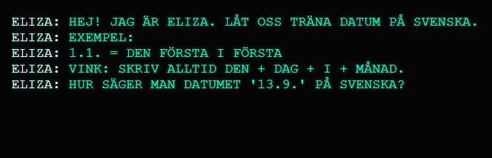

# ELIZA – Datum på svenska

En interaktiv ELIZA-terminal som tränar datum på svenska.

👉 Inspirerad av den klassiska ELIZA från 1966 – fungerar i samma terminalstil.

## Demo
https://jarisarja-prog.github.io/eliza-datum-svenska/

## Hur det fungerar
Datorn frågar slumpmässiga datum, till exempel:  
"HUR SÄGER MAN DATUMET '23.6.' PÅ SVENSKA?"

Du skriver ditt svar och får direkt feedback.  
Om du klarar 10 rätt i rad får du ett diplom.

## Målgrupp
Studerande på nivå A1–A2.

## Teknik
- HTML  
- JavaScript  

## Screenshot
